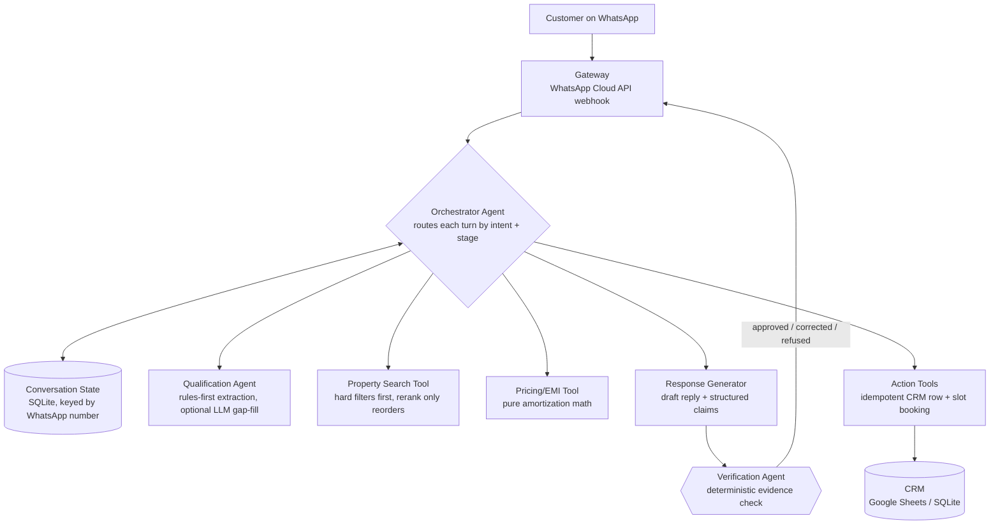

# Sales Copilot — a WhatsApp sales system that can't confidently lie

**ChatGPT Codex Hackathon 2026 · Domain Agents / AI for Bharat’s Businesses**

An agentic sales system for WhatsApp, demoed against one vertical done well:
**residential real estate in Ahmedabad**. Not a prompt wired to WhatsApp — a
small team of cooperating agents and deterministic tools with a real
**verification step**: every factual property claim is tagged with the record
field it rests on and checked against that record *before* it is sent. A claim
without evidence never goes out as stated.

🌐 **Live demo:** **https://sales-bot-rust.vercel.app** — the browser chat
simulator, running the real backend. Tap the prompts to walk the demo,
including the trap question.

📹 **Demo video:** _TODO — add public link before submission (see checklist below)._

📝 **Project description:** [SUBMISSION.md](SUBMISSION.md) is the approved
source content for the required public Google Doc. _TODO — publish the Doc and
add its share link before final submission._

> **Note on the hosted demo:** Vercel is serverless, so session state lives in
> ephemeral `/tmp` SQLite — fine for a single continuous demo, but it resets on
> cold starts and isn't shared across instances. WhatsApp (Task 0B) and a
> durable store (Postgres/Google Sheets) are the production path; the hosted
> URL is a convenience demo, not production infrastructure.

## Why this isn't another LLM wrapper

Production data across funded support/sales AI platforms shows complex queries
resolving only ~15–30% of the time — mostly because nothing catches the model
when it is *confidently wrong*. The market values the problem (Salesforce
signed a definitive agreement in June 2026 to acquire Fin for ~$3.6B); this
project is a working proof of the missing piece, not a from-scratch competitor
to Interakt/Haptik.

The centerpiece: the Response Generator must emit every factual statement as a
structured claim —

```json
{"statement": "3BHK", "property_id": 2, "evidence_field": "bhk", "claimed_value": 3}
```

— and the **Verification Agent** checks each claim deterministically against
the property record. Three verdicts:

| Verdict | What happens |
| --- | --- |
| SUPPORTED | The statement ships as written. |
| CONTRADICTED | Rewritten **from the record** ("Correction: the listed price is ₹95 lakh."). |
| UNSUPPORTED | Refused outright + flagged for human follow-up. Never confirmed. |

EMI figures are re-computed from their own inputs — an invented or tampered
number is corrected deterministically. No LLM judges whether another LLM
hallucinated a structured fact.

## Architecture



Design rules the code actually enforces (each has tests):

1. **State first** — every turn merges into one running lead picture keyed by
   WhatsApp number; nothing is treated as an isolated request.
2. **Deterministic before semantic** — hard filters (BHK, locality, price,
   possession) run first; the preference reranker may only *reorder* already
   filtered candidates, never add or drop one.
3. **Tools, not agents, do arithmetic and side effects** — EMI, CRM writes,
   and bookings are pure/idempotent functions. LLMs never do money math.
4. **Idempotency by message ID** — a replayed webhook returns the original
   result; duplicate CRM rows and double-bookings are structurally impossible.
5. **PII masking everywhere** — logs, API responses, CRM rows, and bookings
   carry masked numbers (`********0011`) only.

## Small-model cost routing (opt-in)

Set `LLM_ROUTING_ENABLED=true` (with a key present) and each turn is routed by
deterministic signals — the choice is logged every turn:

| Tier | When | Cost |
| --- | --- | --- |
| `rules_only` | rules fully parsed a short, unambiguous message | **no LLM call** |
| `small` | short message with a parse gap | cheap model (`gemini-2.5-flash-lite`) |
| `large` | negotiation/ambiguity, long, or code-switched with no rule coverage | strong model (`gemini-2.5-flash`) |

Because the deterministic rules already resolve the common qualification turns
(budget, BHK, locality), most of a normal conversation routes to `rules_only`
— the router's biggest saving is *not calling a model at all*. It is off by
default so the graded path is unchanged, and the policy is pure (text + rule
fields → tier), so it is fully tested without any API key.

## The trap question, end to end

The five demo fixtures deliberately have **no `private_pool` field**. Live
demo moment:

> **Customer:** Does the Shela property have a private pool?
>
> **Draft (internal, assertive on purpose):** "Yes — it has a private pool."
> with claim `{"property_id": 2, "evidence_field": "private_pool", "claimed_value": true}`
>
> **Verification Agent:** no such evidence field on property #2 → UNSUPPORTED
>
> **Sent to customer:** "I can't confirm a private pool from the verified
> listing data, so I won't state it as fact. I've flagged this for a human
> agent to confirm with the builder."
>
> **Side effect:** a `HANDOFF` row lands in the CRM.

An eval case asserts no property in the dataset can ever get a pool claim
through, and the full scenario (including this moment) runs as one automated
end-to-end test.

## Implemented vs. designed for extension

### Implemented — working, tested (248 tests, `pytest`)

- FastAPI webhook validating WhatsApp Cloud API payloads (mock-driven locally),
  with Meta's GET verification handshake, optional HMAC signature validation,
  status-receipt handling, and replay-safe outbound delivery.
- Multi-turn conversation state in SQLite keyed by WhatsApp number.
- Qualification Agent: deterministic parsing of Indian budget formats
  (`70 lakh`, `1.2 cr`, `60–80 lakh`, `₹65,00,000`), BHK, locality, intent,
  timeline — plus an optional Gemini pass that can only fill gaps, never
  override rules, and degrades to rules-only on any provider failure.
- Hybrid property search: hard filters → explainable keyword rerank.
- Deterministic EMI tool verified against hand-calculated values.
- Evidence-linked Response Generator + deterministic Verification Agent
  (the trap question is refused; wrong prices are corrected from the record).
- Idempotent CRM + booking tools behind an action ledger; SQLite and Google
  Sheets CRM backends behind one protocol. The Sheets backend accepts a
  deployment-safe service-account JSON environment value and fails safely on
  incomplete configuration.
- Orchestrator wiring the full flow; the complete Ahmedabad demo scenario runs
  as one automated test, including a webhook replay that changes nothing.
- Deterministic sales escalation: explicit human-agent and price-negotiation
  requests create a replay-safe CRM handoff rather than inventing a discount;
  an EMI request records verified high intent while returning calculator output.
- Hinglish: code-switch detection + native rule coverage ("70 lakh tak",
  "3 kamre", "ghar lena hai", "turant"), proven by a full Hinglish
  conversation reaching a verified match.
- 64-case table-driven evaluation suite with pass-rate reporting and CI gates.
- **Small-model cost routing** (opt-in): a three-tier router picks per turn
  between rules-only (no LLM call — the common case here), a cheap model for
  short parse gaps, and a stronger model for ambiguous/negotiation-heavy or
  long turns. The decision is deterministic and logged every turn.
- **ElevenLabs voice transport adapter**: a normalized transcript webhook at
  `/voice/elevenlabs/webhook` reuses the same caller-keyed session state and
  verification-first orchestrator as the text channel. Spoken Hinglish
  normalization covers common budget, BHK, timeline, and locality variants;
  duplicate voice event IDs return the cached reply without replaying actions.
  A configured secret custom header is checked in constant time before a
  public voice webhook is processed.

### Pending credentials (code ready, not yet wired live)

- **Task 0B — real WhatsApp transport**: outbound Meta Cloud API support,
  signature validation, and reply replay protection are implemented; it needs
  a test number, credentials, callback configuration, and one controlled live
  round trip.
- **ElevenLabs live voice check**: the dashboard tool mapping is configured;
  one controlled browser Preview call must be repeated after the latest public
  deployment. Browser Preview has no phone number, so its session safely falls
  back to the ElevenLabs conversation id.
- **Google Sheets as the live CRM backend**: needs a service-account JSON +
  spreadsheet ID in deployment secrets, a shared spreadsheet, and one
  controlled append test; the backend is implemented and mock-tested.
- **Gemini LLM pass**: an `LLM_API_KEY` is configured locally, but
  `LLM_ENABLED=false` keeps the application rules-only until one controlled
  ambiguous Hinglish test is approved. Routing then remains optional; rules
  stay authoritative and provider failures fall back to rules-only behavior.

### Designed for extension — documented only, deliberately NOT built

- Invoice generation
- Feedback collection
- Referral tracking
- Renewal / upsell logic
- Standalone analytics dashboard
- LLM judgment pass for free-text soft claims ("great for families")
- Embedding-based semantic reranker (slots in behind the same search signature)

Dev/demo tooling (not the product, clearly labeled):

- Browser **chat simulator** at `/` — a front door onto `/webhook` for
  demoing and development while real WhatsApp (Task 0B) is pending. WhatsApp
  remains the real channel; the simulator changes no backend behaviour.

## Getting started

```bash
python3 -m venv .venv
source .venv/bin/activate
pip install -r requirements.txt
cp .env.example .env        # fill in your own values; never commit .env

pytest                      # 248 tests
python -m evals.run_evals   # evaluation table below
uvicorn app.main:app --reload
```

Then open **http://localhost:8000/** for the browser **chat simulator** — a
dev/demo front door that posts to the same `/webhook` as WhatsApp (orchestrator,
verification, and CRM untouched). It's the fastest way to walk the full demo,
including the trap question, without WhatsApp credentials. It is **not** the
production channel — WhatsApp (Task 0B) is the real transport.

### Wiring the ElevenLabs voice tool

This integration does not use an ElevenLabs API key in the application. In the
ElevenLabs Agent dashboard, add a **Webhook** tool with the following mapping:

| Setting | Value |
| --- | --- |
| URL | `https://sales-bot-rust.vercel.app/voice/elevenlabs/webhook` |
| Method | `POST` |
| Response timeout | `20` seconds |
| Interruptions | Disabled while the tool is running |
| Secret header | `X-Voice-Webhook-Secret: <same value as ELEVENLABS_WEBHOOK_SECRET>` |

Set the POST body fields as follows. Use the first three dynamic-variable
templates exactly; `event_id` must include the turn count so a new spoken turn
is not treated as a retry of the same conversation.

| Field | Value type | Value |
| --- | --- | --- |
| `caller_phone_number` | Dynamic variable | `{{system__caller_id}}` |
| `event_id` | Dynamic variable template | `{{system__conversation_id}}:{{system__agent_turns}}` |
| `transcript` | LLM prompt | The caller's latest words verbatim. Do not summarize or add facts. |
| `timestamp` | Dynamic variable | `{{system__time_utc}}` |

Tell the ElevenLabs agent to call this tool after each caller turn and speak
the returned `reply` value exactly. Keep `ELEVENLABS_WEBHOOK_SECRET` only in
the ElevenLabs secret header and local/deployment environment variables. Run
one short test call only after checking the available credit balance.

For browser Preview, `system__caller_id` is empty. That is supported: the
server uses the conversation part of `event_id` as a stable preview-only
session key. Phone calls continue to use the real caller number.

The mapping uses ElevenLabs'
[webhook-tool authentication](https://elevenlabs.io/docs/eleven-agents/customization/tools/webhook-tools)
and [system dynamic variables](https://elevenlabs.io/docs/eleven-agents/customization/personalization/dynamic-variables).

Or simulate a customer message from the shell (no WhatsApp account needed):

```bash
curl -s -X POST localhost:8000/webhook -H 'Content-Type: application/json' -d '{
  "object": "whatsapp_business_account",
  "entry": [{"id": "E", "changes": [{"field": "messages", "value": {
    "messaging_product": "whatsapp",
    "messages": [{"from": "915550000011", "id": "wamid.DEMO1",
                  "timestamp": "0", "type": "text",
                  "text": {"body": "2BHK in Bopal under 70 lakh, buying"}}]}}]}]
}'
```

### Wiring real WhatsApp (Task 0B)

1. Create an app at developers.facebook.com → add the WhatsApp product → API
   Setup gives a free test number, temporary access token, and phone number ID.
2. Put `WHATSAPP_ACCESS_TOKEN`, `WHATSAPP_PHONE_NUMBER_ID`, and a random
   `WHATSAPP_VERIFY_TOKEN` in `.env`.
3. Expose the server (e.g. an HTTPS tunnel), set the webhook URL in Meta's
   console with that verify token — the GET handshake endpoint already works.

### Wiring the Google Sheets CRM

1. Create a Google Cloud service account with the Sheets API enabled; download
   its JSON key **outside the repo**.
2. Share the target spreadsheet with the service-account email.
3. Set `GOOGLE_SHEETS_SERVICE_ACCOUNT_JSON` and
   `GOOGLE_SHEETS_SPREADSHEET_ID` in `.env`. The composition root in
   [app/deps.py](app/deps.py) automatically chooses `SheetsCrmBackend` only
   when both are valid; SQLite remains the safe default.

## Evaluation results

One table-driven suite ([evals/cases.json](evals/cases.json), 64 cases), run
with a single command:

```bash
python -m evals.run_evals
```

This is a **small hackathon evaluation set, not a production benchmark**.
Every case runs against the real production components — no mocks. The suite
includes a Hindi-script BHK turn on the deterministic rules-only path; broader
Hindi understanding remains a documented extension. The same targets are
enforced as a CI gate in [tests/test_evals.py](tests/test_evals.py).

| Category | Passed | Total | Rate | Target | Status |
| --- | --- | --- | --- | --- | --- |
| qualification | 10 | 10 | 100.0% | ≥90% | ✅ |
| state_merging | 4 | 4 | 100.0% | ≥100% | ✅ |
| retrieval | 8 | 8 | 100.0% | ≥90% | ✅ |
| no_match | 4 | 4 | 100.0% | ≥100% | ✅ |
| unsupported_claim | 6 | 6 | 100.0% | ≥100% | ✅ |
| price_claim | 4 | 4 | 100.0% | ≥100% | ✅ |
| emi | 5 | 5 | 100.0% | ≥100% | ✅ |
| hinglish | 8 | 8 | 100.0% | ≥85% | ✅ |
| ambiguous | 4 | 4 | 100.0% | ≥100% | ✅ |
| booking_duplication | 2 | 2 | 100.0% | ≥100% | ✅ |
| handoff | 3 | 3 | 100.0% | ≥100% | ✅ |
| routing | 6 | 6 | 100.0% | ≥100% | ✅ |
| **Overall** | **64** | **64** | **100.0%** | — | — |

## Build progress

| Task | Status |
| --- | --- |
| 0A — Local scaffold, mocked WhatsApp webhook + tests | ✅ Done |
| 0B — Real WhatsApp transport | 🧪 Code complete; controlled live test pending |
| 1 — Conversation state + Qualification Agent | ✅ Done |
| 2 — Property Search Tool (hybrid retrieval) | ✅ Done |
| 3 — Pricing/EMI Tool | ✅ Done |
| 4 — Evidence-linked response + Verification Agent | ✅ Done |
| 5 — Idempotent action tools (CRM + booking) | ✅ Done |
| 6 — Orchestrator wired end to end | ✅ Done |
| 7 — Hinglish handling | ✅ Done |
| 8 — Evaluation suite | ✅ Done |
| 9 — Docs + demo script | 🧪 Repo docs complete; public Google Doc + video pending |
| 10 — Small-model routing (optional) | ✅ Done (opt-in) |

## Demo

The full 2–3 minute run sheet — message by message, with expected replies and
what to show on screen — is in **[DEMO.md](DEMO.md)**. The trap-question
moment is the centerpiece.

**Submission checklist**

- [x] Repo is public (unauthenticated HTTPS check passed 2026-07-22)
- [ ] Public Google Doc created from `SUBMISSION.md` and linked here
- [ ] Demo video is public, 2–3 minutes, includes the trap-question moment
- [ ] No phone numbers or tokens visible in the video or screenshots
- [ ] Demo video link added at the top of this README

## Privacy & security

- Phone numbers are masked (`********0011`) in logs, API responses, CRM rows,
  and bookings; all numbers in tests/fixtures are synthetic.
- Secrets live in `.env` (gitignored from the first commit); the Gemini key
  travels in a request header, never in a URL.
- An automated test scans tracked files for token-shaped strings and asserts
  no `.env`/credentials file is ever committed.

## Project layout

```text
app/
├── main.py            # FastAPI app factory (+ serves the chat simulator at /)
├── static/            # simulator.html — browser chat simulator (dev/demo)
├── config.py          # pydantic-settings (.env)
├── orchestrator.py    # routes each turn; verification gates every reply
├── deps.py            # composition root
├── privacy.py         # PII masking
├── inr.py             # ₹ formatting
├── gateway/           # webhook endpoints + payload schemas
├── state/             # SessionState + SQLite store
├── nlu/               # rules extractor, Hinglish, questions, intents, LLM hybrid
├── llm/               # provider protocol + Gemini implementation
├── agents/            # qualification, response generator, verification, claims
├── properties/        # Property model + JSON repository
├── tools/             # property search, EMI
└── actions/           # idempotent CRM + booking + action ledger
data/properties.json   # the five demo fixtures (no private_pool — deliberate)
evals/                 # table-driven eval cases + runner
tests/                 # 248 tests incl. full end-to-end demo scenario
```
